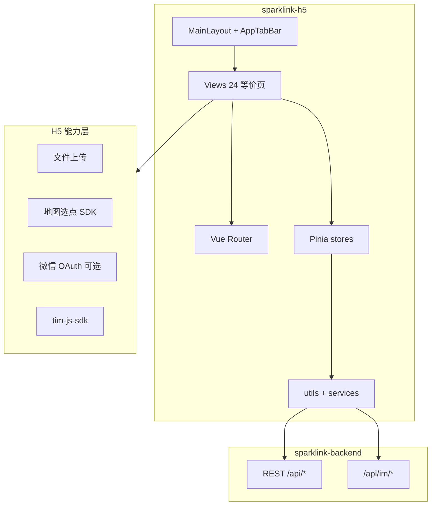

# Spark Link H5 与小程序 1:1 对齐 — 设计说明

| 项 | 内容 |
|----|------|
| 日期 | 2026-05-23 |
| 范围 | C — 尽量 1:1（24 页功能与交互对齐） |
| 基线工程 | `sparklink-h5/`（Vue 3 + Vite + Vant） |
| 参考 | `sparklink-mini-program/` |
| 状态 | 待评审 |

---

## 1. 目标与非目标

### 目标

- H5 在功能与交互上与微信小程序等价：相同 Tab 结构、页面跳转关系、表单字段与 API 调用。
- 可部署至阿里云（Nginx 静态 + `/api` 反代），并具备与 `部署/H5-UAT-CHECKLIST.md` 一致的验收标准。
- 在现有 `sparklink-h5` 上扩展，复用 `request`、`imService`、`partnerListMap`、`mediaUrl` 等。

### 非目标

- 不替换现有小程序代码为跨端框架（Taro/Uni-app）。
- 不在本阶段实现小程序专属能力：`onShareAppMessage`、版本更新管理器（可用 Web Share 替代或省略）。
- 微信 OAuth 依赖企业资质与开放平台配置，可作为 M3 里程碑，不阻塞 M1/M2。

---

## 2. 架构



**技术栈**：Vue 3、Vite 5、Vue Router 4、Pinia、Axios、Vant 4、`tim-js-sdk`。

**设计令牌**：对齐 `sparklink-mini-program/styles/variables.wxss`（主色 `#5FB3A8`、背景 `#F5FAF9`、圆角与间距换算为 px/rem）。

---

## 3. 路由与页面对照

| # | 小程序 path | H5 路由 | 布局 | 现状 |
|---|-------------|---------|------|------|
| 1 | pages/login/login | `/login` | 全屏 | 已有，需补协议链路与登录方式 |
| 2 | pages/agreement/user-agreement | `/agreement/user` | 全屏 | 待建 |
| 3 | pages/agreement/privacy-policy | `/agreement/privacy` | 全屏 | 待建 |
| 4 | pages/index/index | `/home` | Tab | 已有，对齐快捷入口与样式 |
| 5 | pages/ai-chat/ai-chat | `/ai-chat` | 全屏 | 已有，对齐推荐卡片 |
| 6 | pages/partner/partner | `/partner` | Tab | 已有，增加筛选入口 |
| 7 | pages/partner-detail/partner-detail | `/partner/:id` | 全屏 | 已有，对齐申请/联系 |
| 8 | pages/partner-publish/partner-publish | `/partner-publish` | 全屏 | 已有，对齐表单完整度 |
| 9 | pages/filter/filter | `/partner/filter` | 全屏 | 待建 |
| 10 | pages/message/message | `/message` | Tab | 已有 |
| 11 | pages/chat/chat | `/chat` | 全屏 | 已有 |
| 12 | pages/profile/profile | `/profile` | Tab | 已有，对齐菜单与统计 |
| 13 | pages/profile-edit/profile-edit | `/profile-edit` | 全屏 | 已有 |
| 14 | pages/settings/settings | `/settings` | 全屏 | 骨架，需对齐 |
| 15 | pages/account-security/account-security | `/settings/account-security` | 全屏 | 待建 |
| 16 | pages/privacy-settings/privacy-settings | `/settings/privacy` | 全屏 | 待建 |
| 17 | pages/about-us/about-us | `/about` | 全屏 | 待建 |
| 18 | pages/my-partner/my-partner | `/my/partners` | 全屏 | 待建 |
| 19 | pages/my-following/my-following | `/my/following` | 全屏 | 待建 |
| 20 | pages/my-followers/my-followers | `/my/followers` | 全屏 | 待建 |
| 21 | pages/user-profile/user-profile | `/user/:id` | 全屏 | 待建 |
| 22 | pages/company/join/company-join | `/join/company` | 全屏 | 待建 |
| 23 | pages/school/join/school-join | `/join/school` | 全屏 | 待建 |

**导航规则**

- Tab 页：`home` / `partner` / `message` / `profile`；中间「+」跳转 `partner-publish`（对齐 `custom-tab-bar`）。
- Tab 重复点击：若当前已在该 Tab，触发 `onTabReselect` 等价逻辑（消息页下拉刷新）。
- 需登录页：`meta.requiresAuth: true`，未登录跳转 `/login?redirect=...`。

---

## 4. 目录与模块划分

```
sparklink-h5/src/
├── components/          # 跨页复用
│   ├── AppTabBar.vue
│   ├── PartnerCard.vue
│   ├── NetworkImage.vue      # 新增：对齐 network-image
│   ├── PageNavBar.vue        # 新增：van-nav-bar 封装
│   └── UserAvatar.vue
├── composables/         # 新增
│   ├── useAuth.js
│   ├── useImUnread.js
│   └── useSafeArea.js        # 顶栏安全区（替代胶囊适配）
├── services/            # 新增：按领域封装 API
│   ├── user.js
│   ├── partner.js
│   ├── follow.js
│   ├── chat.js
│   └── upload.js
├── stores/
│   ├── auth.js
│   ├── im.js                 # 从 imService 抽离状态
│   └── settings.js           # 隐私/通知本地持久化
├── utils/               # 保持并从小程序迁移纯函数
│   ├── request.js
│   ├── imService.js
│   ├── partnerListMap.js
│   ├── partnerPreferenceTags.js
│   ├── mediaUrl.js
│   └── navigateToChat.js     # 新增：对齐小程序聊天跳转
└── views/               # 按路由一页一文件
```

**原则**：View 只负责展示与事件；API 调用进 `services/`；列表映射逻辑继续用 `partnerListMap` 等纯函数，从小程序 `utils/` 逐文件移植而非重写。

---

## 5. 数据流与状态

### 5.1 鉴权

| 存储键 | 用途 |
|--------|------|
| token | JWT |
| userId | X-User-Id |
| userInfo | 资料缓存 |
| isLoggedIn | 布尔标记 |

- 启动：`auth.hydrate()` 从 `localStorage` 恢复 → 有 token 则 `GET /api/user/info` 校验。
- 401 / 「用户不存在」：`request` 拦截器清会话并跳转登录（已实现，保持与小程序 `request.js` 一致）。

### 5.2 IM

- 登录后：Tab 页 `onMounted` 调用 `imService.initAndLogin()`。
- 未读数：`TIM.EVENT.TOTAL_UNREAD_MESSAGE_COUNT_UPDATED` → `auth.setUnreadCount` → `AppTabBar` 角标。
- 退出：`imService.logout()` + `auth.clearLoginState()`（对齐 settings 退出）。

### 5.3 筛选

- 本地键 `filter_partner`（与小程序一致）存筛选条件。
- `PartnerView` 进入时读取；`FilterView` 修改后 `router.back()`，列表页 `onActivated` 刷新。

### 5.4 聊天跳转

统一 `navigateToChat({ userId, nickname, avatar, isAI })`：

- 普通用户 → `/chat?userId=&nickname=&avatar=`
- AI → `/ai-chat` 或 `/chat?isAI=true`

---

## 6. 微信能力 → H5 替代

| 小程序 API | H5 实现 |
|------------|---------|
| wx.login + wechat-login | M1：账号密码 + 注册；M3：微信 OAuth 回调页 `/login/wechat-callback` |
| getUserProfile | OAuth 或资料编辑页补全 |
| chooseLocation / getLocation | 腾讯地图 H5 选点组件（需 key）；降级：手动输入地址 |
| chooseImage / uploadFile | input file + `uploadFile` 封装 |
| getStorageSync | localStorage 封装（已有 `storage.js`） |
| showToast / showModal | Vant Toast / Dialog |

---

## 7. UI/UX 对齐要点

- **TabBar**：5 槽位（首页、搭子、发布、消息、我的）；消息角标 `99+`；发布按钮上浮样式对齐 `custom-tab-bar/index.wxss`。
- **个人中心**：顶部渐变区、头像、昵称、bio 截断规则、统计三列（搭子/粉丝/关注）、菜单六项跳转。
- **搭子列表**：Pick/同事/校友 Tab；卡片字段与 `PartnerCard` 一致；空态文案一致。
- **发布页**：15 类搭子、偏好标签最多 5 个、可见范围位掩码、计划时间、封面图。
- **安全区**：`useSafeArea` 用 `env(safe-area-inset-*)` 替代微信胶囊计算，视觉接近即可。

---

## 8. 错误处理

| 场景 | 行为 |
|------|------|
| 网络失败 | Toast「网络请求失败」 |
| 业务 code≠0 | Toast 后端 message |
| 401 | 清会话 + Toast + 跳转登录 |
| IM 初始化失败 | 消息页空态 + Toast，不阻塞其他 Tab |
| 上传超限 | 对齐后端 5MB，前端压缩可选 |
| 地图/定位拒绝 | 降级手动输入地址 |

---

## 9. 测试与验收

- **API 冒烟**：`scripts/smoke-api.sh`（扩展 follow、partner 发布用例）。
- **页面走查**：以小程序为金标准，逐页勾选交互清单（扩展 `部署/H5-UAT-CHECKLIST.md` 为 24 页版）。
- **本地**：`npm run dev` + 本地/远程 API；开发环境 test-login 仅 DEV。
- **回归**：每次 M 里程碑 `npm run build` + 关键路径浏览器自测。

---

## 10. 交付里程碑

### M1 — 核心 Tab 与搭子（约 1–2 周）

- 对齐 home / partner / partner-detail / partner-publish / filter / login / 协议页
- AI 聊天交互对齐
- TabBar 视觉与 reselect 行为

### M2 — 社交与设置（约 1–2 周）

- message / chat / IM 角标完善
- profile 菜单全跳转；my-partners / following / followers / user-profile
- settings 树（account-security / privacy / about）

### M3 — 入驻与微信（约 1 周，依赖资质）

- company-join / school-join
- 微信 OAuth（若开放平台就绪）
- 地图选点；全量 UAT 与阿里云部署

---

## 11. 风险

| 风险 | 缓解 |
|------|------|
| 线上无测试账号 | 本地 seed + dev test-login；文档说明生产账号 |
| IM Web 域名白名单 | 控制台配置 H5 域名 |
| 1:1 工期长 | 严格按 M1→M2→M3，每里程碑可独立上线 |
| 小程序 WXML 与 Vue 模板差异 | 按页迁移，复用 utils 降低逻辑偏差 |

---

## 12. 开放项（实施前确认）

1. 微信 OAuth 是否已有开放平台网站应用与回调域名？
2. 地图选点优先腾讯还是高德？Key 由谁提供？
3. 生产 H5 域名是否定为 `h5.aipick.cloud` 或路径子目录？

---

*§1 架构与路由已由负责人确认（2026-05-23）。§2–§3 已并入本文档。*
