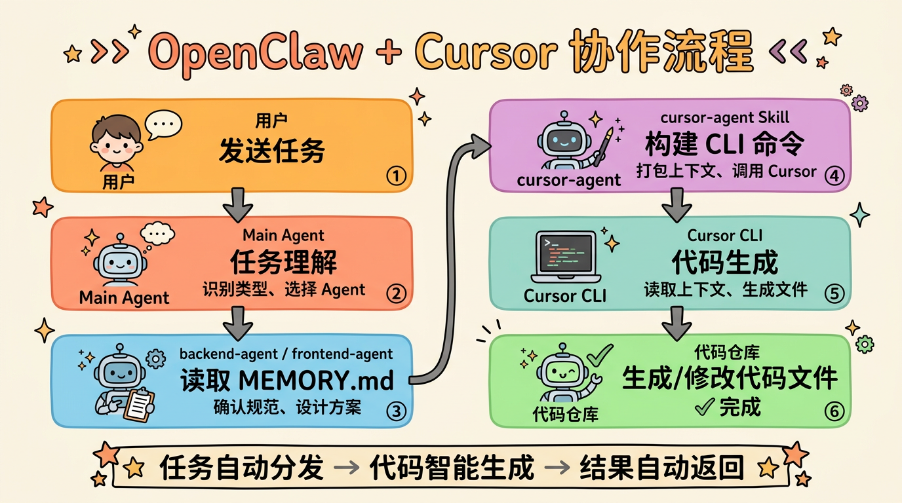
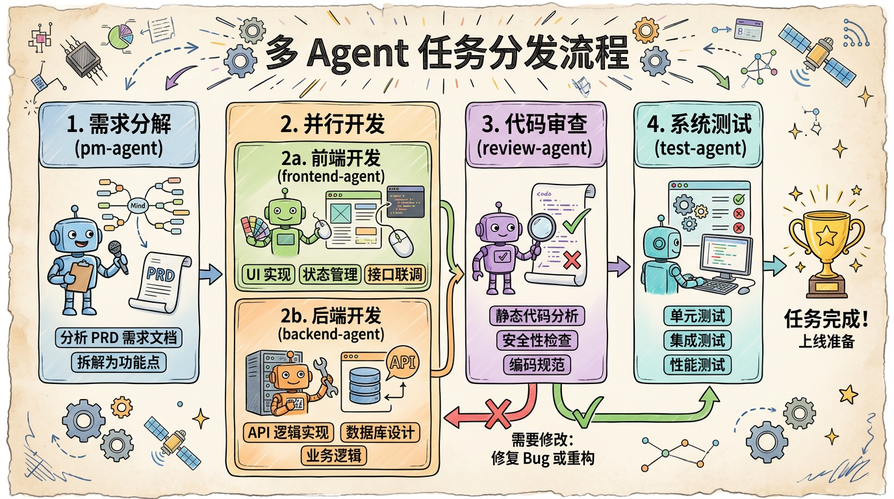
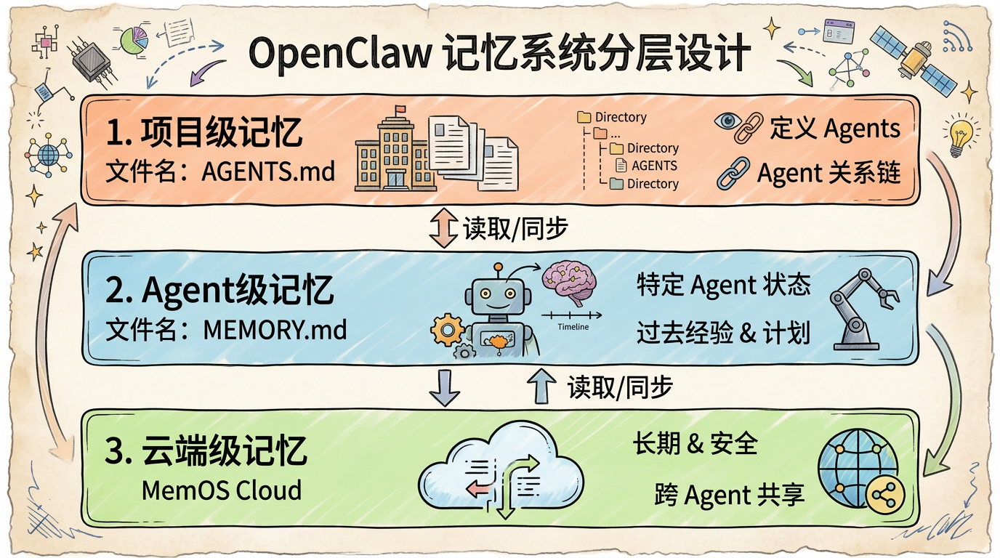
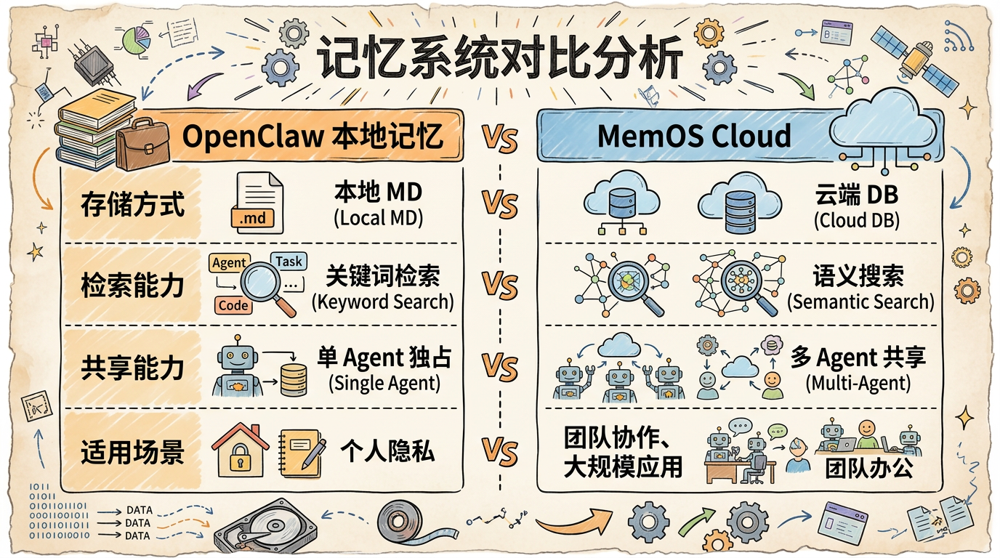
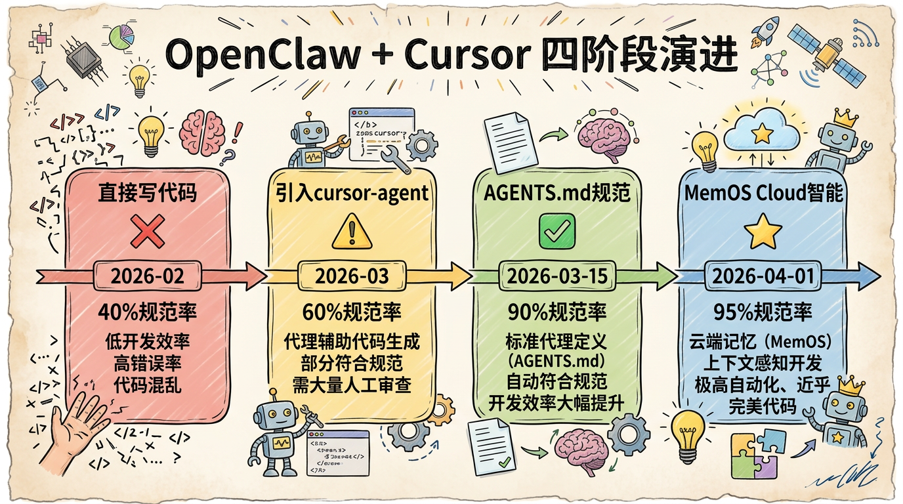
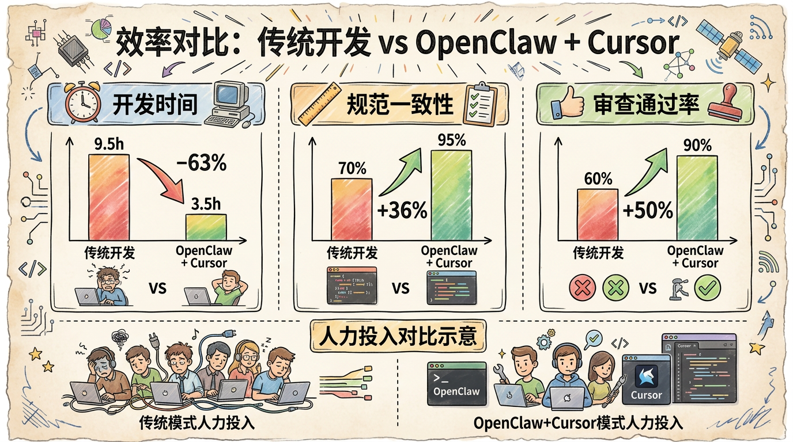

# OpenClaw 与 Cursor 联动开发实践（V2）

## 目录

1. [引言](#第1章-引言)
2. [Cursor 集成方案](#第2章-cursor-集成方案)
3. [cursor-Agent Skill 实践](#第3章-cursor-agent-skill-实践)
4. [记忆系统协作](#第4章-记忆系统协作)
5. [MemOS Cloud 插件实践](#第5章-memos-cloud-插件实践)
6. [记忆技术对比分析](#第6章-记忆技术对比分析)
7. [演进历程与实战案例](#第7章-演进历程与实战案例)
8. [最佳实践与总结](#第8章-最佳实践与总结)

---

## 第1章 引言

### 1.1 背景：AI 辅助开发的演进

AI 辅助开发正在经历三代演进：


| 代际 | 代表 | 特点 | 局限 |
|------|------|------|------|
| 第一代 | GitHub Copilot | 代码补全，被动响应 | 单文件视角，缺乏项目理解 |
| 第二代 | Cursor、Claude Code | 对话式开发，多文件操作 | 单 Agent 模式，记忆不持久 |
| **第三代** | **OpenClaw + Cursor** | **多 Agent 协作，记忆共享** | **本文重点** |

**关键洞察**：OpenClaw 与 Cursor 不是竞争关系，而是**互补协作**——OpenClaw 负责**任务编排和多 Agent 协作**，Cursor 负责**代码生成和编辑器内操作**。

### 1.2 本文核心问题

在《开局一只🦞》中，我们解决了"如何组织多 Agent 协作开发"的问题。但实践中发现一个新瓶颈：

> **Agent 之间的记忆无法共享**

- backend-agent 踩过的坑，frontend-agent 重复踩
- review-agent 发现的规范问题，其他 Agent 继续犯
- 每个 Agent 的 MEMORY.md 是孤岛，知识无法流动

**本文目标**：解决多 Agent 协作中的**记忆共享**问题，实现从"独立记忆"到"云端共享记忆"的跃迁。

---

## 第2章 Cursor 集成方案

### 2.1 内容概述

OpenClaw 与 Cursor 的协作模型采用**分层架构**，通过 cursor-agent Skill 作为桥梁，实现任务自动分发到代码生成。


**核心流程**：

```
用户发送任务 → Main Agent → 专业 Agent → cursor-agent Skill → Cursor CLI → 代码生成 → 审查/测试 → 任务完成
```

**关键组件**：

| 组件 | 功能 | 说明 |
|------|------|------|
| Main Agent | 任务理解和分发 | 选择专业 Agent |
| cursor-agent Skill | 协议转换和上下文打包 | 构建 Cursor CLI 命令 |
| Cursor CLI | 代码生成执行 | 基于项目上下文生成代码 |
| review-agent | 代码审查 | 质量把关 |

**上下文传递机制**：



OpenClaw 将 AGENTS.md（项目规范）、MEMORY.md（任务状态）、用户任务描述打包，通过 cursor-agent Skill 传递给 Cursor CLI，确保生成的代码符合项目规范。

---

## 第3章 cursor-Agent Skill 实践

### 3.1 Skill 的角色定位

cursor-agent Skill 是 OpenClaw 与 Cursor 之间的**桥梁**，承担四个角色：


| 角色 | 职责 |
|------|------|
| **协议转换器** | 将 OpenClaw 指令转换为 Cursor CLI 命令 |
| **上下文打包器** | 提取相关文件，构建 Cursor 上下文 |
| **执行监控器** | 监控 Cursor 执行过程，捕获输出 |
| **结果解析器** | 解析 Cursor 输出，格式化返回结果 |

### 3.2 多 Agent 协作流程



**完整协作流程**：

```
用户提交任务
    ↓
Main Agent 理解任务（识别类型、选择 Agent）
    ↓
分发到 backend-agent/frontend-agent
    ↓
读取 MEMORY.md + AGENTS.md + MemOS 历史经验
    ↓
调用 cursor-agent 生成代码
    ↓
代码审查（review-agent）
    ↓
测试验证（test-agent）
    ↓
任务完成，经验沉淀到 MemOS
```

### 3.3 实战案例：AI-Pick 项目

**任务**：开发"搭子列表分页查询"接口

**协作演示**：


**效率数据**（单接口）：

| 指标 | 传统开发 | OpenClaw + Cursor | 提升 |
|------|----------|-------------------|------|
| 开发时间 | 4-6 小时 | 30-60 分钟 | **5-8x** |
| 审查通过率 | 60% | 90% | **50%** |
| 返工次数 | 2-3 次 | 0-1 次 | **70%** |

---

## 第4章 记忆系统协作

### 4.1 三层记忆架构



| 记忆层级 | 存储位置 | 生命周期 | 共享范围 | 典型内容 |
|----------|----------|----------|----------|----------|
| **项目级** | AGENTS.md | 长期 | 所有 Agent | 团队架构、代码规范 |
| **Agent 级** | MEMORY.md | 任务周期 | 单 Agent | 当前任务、待办事项 |
| **云端级** | MemOS Cloud | 永久 | 多 Agent | 历史经验、最佳实践 |

### 4.2 本地与云端记忆的协作

**数据流转规则**：

| 数据类型 | 存储位置 | 说明 |
|----------|----------|------|
| 当前任务状态 | MEMORY.md | 实时更新，本地为主 |
| 最佳实践 | MemOS Cloud | 自动捕获，云端共享 |
| 错误教训 | MemOS Cloud | 自动捕获，避免重复 |
| 关键决策 | 两者都有 | 重要决策双向同步 |

**冲突解决策略**：
1. 时效性优先：以最新修改的记录为准
2. 来源权重：review-agent > pm-agent > 开发 Agent
3. 人工仲裁：重要冲突由项目协调者确认

---

## 第5章 MemOS Cloud 插件实践

### 5.1 为什么需要云端记忆？

**本地记忆的局限**：
- ❌ 文件级记忆，需要 Agent 主动读取
- ❌ 跨会话检索效率低
- ❌ 不同 Agent 之间无法共享

**MemOS Cloud 的价值**：
- ✅ 云端语义存储，多 Agent 共享
- ✅ 自动捕获最佳实践和错误教训
- ✅ 基于场景自动回忆相关经验
- ✅ 生命周期钩子，关键节点自动触发

### 5.2 MemOS Cloud 插件架构


### 5.3 核心功能详解

#### 5.3.1 自动回忆（Auto-Recall）

**工作原理**：

```
用户发送任务请求
    ↓
MemOS 插件提取任务关键词（如"搭子列表接口"）
    ↓
语义搜索相关历史记忆
    ↓
将记忆片段注入系统提示词
    ↓
Agent 基于增强上下文处理任务
```

#### 5.3.2 记忆捕获（Memory Capture）

| 时机 | 捕获内容 | 存储类型 |
|------|----------|----------|
| 任务完成时 | 任务结果、关键决策 | DECISION |
| 发现错误时 | 错误原因、解决方案 | ERROR → LEARNING |
| 审查通过时 | 代码优点、改进建议 | LEARNING |

#### 5.3.3 语义搜索（Semantic Search）

**使用场景**：
- Agent 遇到报错 → 搜索"MyBatis 绑定错误"
- 设计新接口 → 搜索"RESTful 规范"
- review 代码 → 搜索"代码审查清单"

### 5.4 实践效果

**量化指标**（引入 MemOS 前后对比）：

| 指标 | 使用前 | 使用后 | 提升 |
|------|--------|--------|------|
| 重复错误率 | 25% | 5% | **80% ↓** |
| 规范一致性 | 70% | 95% | **36% ↑** |
| 任务交接时间 | 15 min | 2 min | **87% ↓** |
| 知识检索时间 | 10 min | 30 sec | **95% ↓** |

---

## 第6章 记忆技术对比分析

### 6.1 主流记忆系统概览



| 记忆系统 | 类型 | 存储方式 | 检索能力 | 共享能力 |
|----------|------|----------|----------|----------|
| **OpenClaw MEMORY.md** | 文件级 | 本地 Markdown | 关键词匹配 | 单 Agent |
| **MemOS Cloud** | 云端 | 向量数据库 | **语义搜索** | **多 Agent** ⭐ |
| LangChain Memory | 框架级 | 内存/Redis | 窗口检索 | 单会话 |
| Claude 上下文窗口 | 模型级 | 模型内部 | 全量检索 | 单会话 |

### 6.2 选型建议

**单 Agent 场景**：OpenClaw MEMORY.md + Claude 上下文

**多 Agent 协作场景**：**OpenClaw MEMORY.md + MemOS Cloud**（本文推荐方案）
- MEMORY.md 管理每个 Agent 的当前任务状态
- MemOS 实现跨 Agent 经验共享
- 自动捕获和回忆，减少人工干预

---

## 第7章 演进历程与实战案例

### 7.1 四阶段演进



| 阶段 | 时间 | 核心特征 | 代码规范率 |
|------|------|---------|-----------|
| 第一阶段 | 2026-02 | 直接写代码 | 40% |
| 第二阶段 | 2026-03 | 引入 cursor-agent | 60% |
| 第三阶段 | 2026-03-15 | 建立 AGENTS.md | 90% |
| **第四阶段** | **2026-04-01** | **引入 MemOS Cloud** ⭐ | **95%** |

### 7.2 实战案例：内容安全审核功能开发

**任务**：接入阿里云内容安全 API，实现敏感内容自动审核

**MemOS 的价值体现**：

```
Day 1 - 需求分析
━━━━━━━━━━━━━━━━━━━━━━━━━━━━━━━━━━━━━━━━
backend-agent 开始工作
  1. 读取 MemOS "第三方 API 集成经验"
  2. 自动回忆历史教训："API 密钥不要硬编码"
  3. 避免踩坑，直接采用正确方案

Day 2 - 代码审查
━━━━━━━━━━━━━━━━━━━━━━━━━━━━━━━━━━━━━━━━
review-agent 审查通过
  自动捕获到 MemOS："第三方 API 集成最佳实践"
  自动捕获到 MemOS："API 超时处理方案"

后续任务
━━━━━━━━━━━━━━━━━━━━━━━━━━━━━━━━━━━━━━━━
其他 Agent 开发类似功能时
  自动回忆上述经验，避免重复踩坑
```

**效率数据**：
- 预估时间：11 小时
- 实际时间：9 小时（节省 18%）
- 关键节省：避免重复踩坑减少返工

### 7.3 效率对比



**关键数据对比**（引入 MemOS 前后）：

| 指标 | 使用前 | 使用后 | 提升 |
|------|--------|--------|------|
| 重复错误率 | 25% | 5% | **75% ↓** |
| 任务交接时间 | 10 min | 2 min | **80% ↓** |
| 知识检索时间 | 5 min | 30 sec | **90% ↓** |

---

## 第8章 最佳实践与总结

### 8.1 记忆管理策略

#### 数据流转规则

| 数据类型 | 存储位置 | 同步方向 | 说明 |
|----------|----------|----------|------|
| 当前任务状态 | MEMORY.md | 本地为主 | 实时更新 |
| **最佳实践** | **MemOS** | **云端为主** | **自动捕获，供所有 Agent 共享** ⭐ |
| **错误教训** | **MemOS** | **云端为主** | **自动捕获，避免重复踩坑** ⭐ |
| 关键决策 | 两者都有 | 双向同步 | 重要决策 |

### 8.2 核心观点

1. **记忆系统是 AI Agent 协作的基础设施**
   - 没有记忆系统，Agent 只能做一次性任务
   - 有了记忆系统，Agent 才能持续学习和进化

2. **本地记忆和云端记忆不是竞争关系**
   - 本地记忆（OpenClaw）：管理当前状态，快速访问
   - 云端记忆（MemOS）：沉淀历史经验，跨 Agent 共享
   - 两者结合，优势互补

3. **多 Agent 协作必须解决记忆共享问题**
   - 独立记忆 = 重复犯错、信息孤岛
   - 共享记忆 = 经验传承、协作效率

### 8.3 实践建议

**对于刚开始使用多 Agent 协作的团队**：
1. 先用好 OpenClaw 的 MEMORY.md，养成记录习惯
2. 遇到跨 Agent 知识共享需求时，引入 MemOS Cloud
3. 制定明确的数据流转规则，避免冲突

**对于已有一定经验的团队**：
1. 建立三层记忆架构（项目级、Agent 级、云端级）
2. 配置生命周期钩子，实现自动捕获和回忆
3. 定期回顾记忆库，沉淀最佳实践

### 8.4 未来展望

**记忆系统演进方向**：

1. **从被动到主动**：记忆系统主动推送相关经验
2. **从单模态到多模态**：支持代码、设计稿、文档等多模态记忆
3. **从静态到动态**：记忆自动更新、过期、归档
4. **从孤立到互联**：跨项目、跨团队的知识图谱

---

## 写在最后

记忆系统让 AI Agent 从"工具"变成了"团队一员"。它不仅能记住你教给它的知识，还能从错误中学习，在协作中成长。

正如人类团队需要知识库和文档系统，AI Agent 团队也需要记忆系统。MemOS Cloud 插件与 OpenClaw 记忆系统的协作实践，加上 cursor-Agent Skill 的代码生成能力，为我们提供了一个完整的解决方案。

未来，随着记忆技术的不断发展，AI Agent 的协作能力将会越来越强。而我们能做的，就是不断探索、实践、总结，让 AI 真正成为提升生产力的利器。

---

**延伸阅读**：
- 《开局一只🦞，功能全靠爆——基于多 Agent 协作的微信小程序快速开发实践》：了解多 Agent 协作基础架构和开发流程

*（完）*
